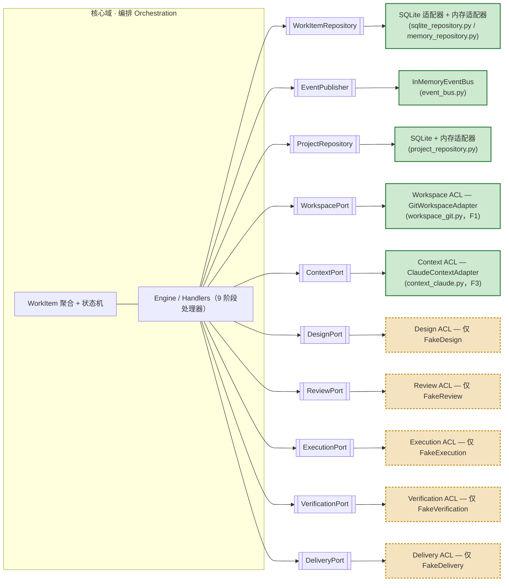
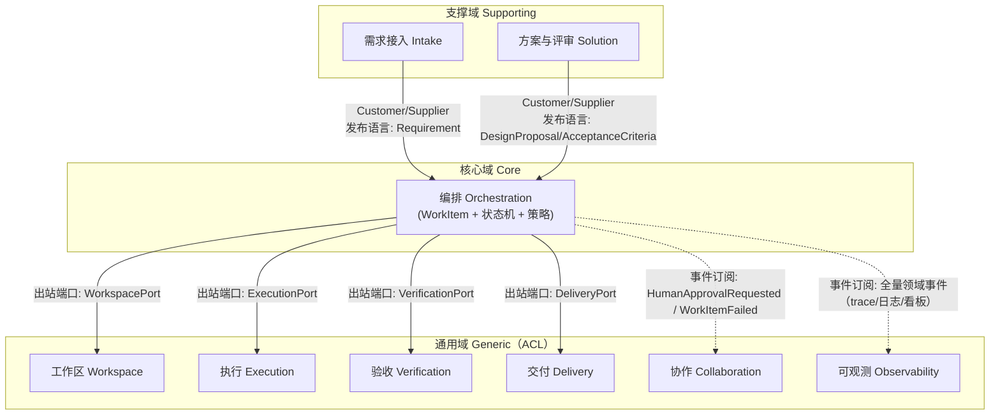
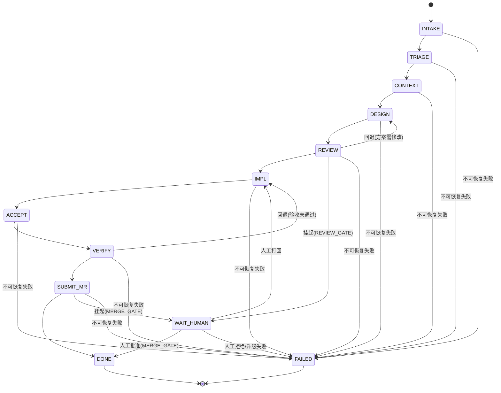
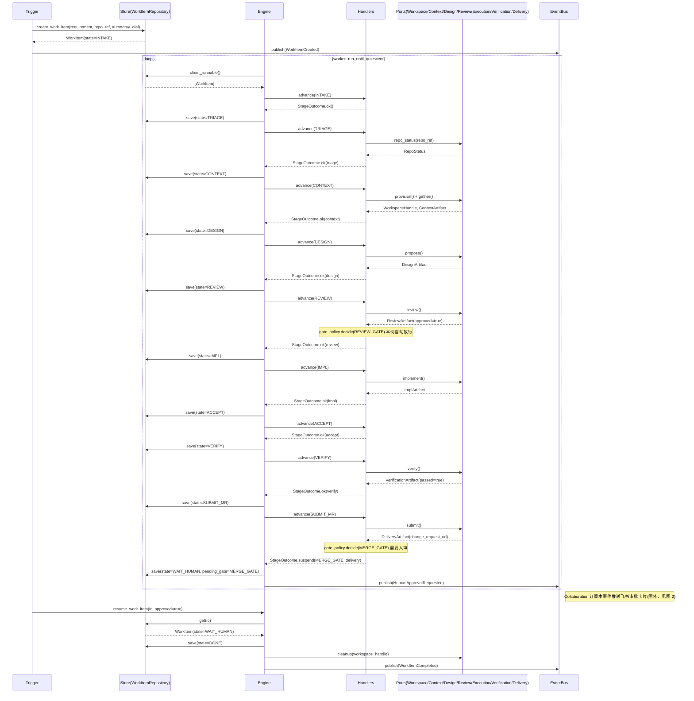

# AutoDev — 架构图

> 关联：`docs/architecture/2026-07-15-strategic-direction-and-domain-model.md`（权威架构基准，本文档的图与其文字描述一致，如有出入以代码 + 本图为准）。
> 状态机图（图 3）逐条对照 `src/autodev/domain/work_item.py` 的 `_build_allowed()` 生成，与代码不存在偏差。

## 1. 系统架构 / 六边形（Ports & Adapters）

核心编排域位于中心，通过 10 个出站端口与外部世界解耦；目前 `WorkItemRepository`（SQLite / 内存两种实现）、`ProjectRepository`（SQLite / 内存，项目聚合持久化）、`EventPublisher`（内存事件总线）、`WorkspacePort`（GitWorkspaceAdapter，F1）、`ContextPort`（ClaudeContextAdapter，F3）已有生产可用的适配器，其余 5 个端口在当前仅有测试用的 Fake 实现（`tests/fakes.py`），尚待真实 ACL 适配器落地。

图例：绿色 = 已实现（5 个：`WorkItemRepository`、`ProjectRepository`、`EventPublisher`、`WorkspacePort`、`ContextPort`）；橙色虚线 = 当前仅有 Fake、待补真实 ACL 适配器（5 个：Design/Review/Execution/Verification/Delivery）。另有一个驱动侧适配器 —— 项目控制台（`src/autodev/webapp/` + `frontend/`，以 Project 为中心），用 F1+F3 驱动工作项至 CONTEXT。

## 2. 限界上下文映射

核心（编排）居中；支撑域（Intake、Solution）以 Customer-Supplier 关系向核心提供结构化发布语言；通用域（Workspace/Execution/Verification/Delivery 等）反向实现核心定义的出站端口；Collaboration、Observability 以订阅领域事件的方式与核心解耦集成。

说明：`ContextPort` / `DesignPort` / `ReviewPort` 三个端口在概念上归属 Solution/Execution 上下文的智能体能力（详见架构基准第 4 节脚注），为避免与图 1 的端口视角重复，本图仅按“6 个通用上下文 + 2 个支撑上下文”的力度展示上下文关系。

## 3. WorkItem 状态机

状态与转移**逐条**对照 `src/autodev/domain/work_item.py::_build_allowed()` 生成：10 个线性阶段（INTAKE→…→DONE）、2 条回退（VERIFY→IMPL、REVIEW→DESIGN）、2 个人审挂起点（REVIEW/SUBMIT_MR→WAIT_HUMAN）、WAIT_HUMAN 的两种唤醒去向（IMPL/DONE），以及“任意非终态→FAILED”的收敛兜底。

## 4. 阶段时序 / 数据流

以一个 `SMALL_CHANGE` 任务为例：创建后由 worker 循环 `run_until_quiescent` 反复 `claim_runnable + advance`，依次推进 9 个阶段（INTAKE…SUBMIT_MR），在 `SUBMIT_MR` 阶段因 `MERGE_GATE` 需人审而挂起为 `WAIT_HUMAN`；人工审批通过后经 `resume_work_item` 直接进入 `DONE` 并做收尾清理。

## 5. WorkItem 聚合数据模型

```mermaid
classDiagram
    class Project {
        +ProjectId id
        +str name
        +str repo_source
        +str branch
        +AutonomyDial autonomy_dial
        +datetime created_at
        +create(id, name, repo_source, branch, now)
        +mark_prepared(branch, now)
    }

    class WorkItem {
        +WorkItemId id
        +ProjectId project_id
        +str base_branch
        +RepoRef repo_ref
        +Requirement requirement
        +AutonomyDial autonomy_dial
        +TaskType type
        +WorkflowState state
        +dict~str,list~ artifact_versions
        +list~StateTransition~ history
        +RetryLedger retry_ledger
        +Cost cost
        +GatePoint pending_gate
        +datetime created_at
        +datetime updated_at
        +transition_to(new_state, reason, now)
        +suspend(gate_point, reason, now)
        +resume_to(target, reason, now)
        +add_artifact(key, artifact)
        +current_artifact(key)
        +versions_of(key)
    }

    class StateTransition {
        +WorkflowState from_state
        +WorkflowState to_state
        +str reason
        +datetime at
    }

    class Requirement {
        +str goal
        +str target_repo
        +tuple acceptance_hints
        +str raw_text
        +is_complete() bool
    }

    class RepoRef {
        +str name
    }

    class AutonomyDial {
        +frozenset auto_gates
        +needs_human(task_type, repo, gate) bool
    }

    class RetryLedger {
        +frozenset counts
        +count(key) int
        +incremented(key) RetryLedger
    }

    class Cost {
        +int tokens
        +plus(n) Cost
    }

    class TriageArtifact {
        +TaskType level
        +float confidence
        +WorkspaceMode workspace_mode
    }
    class ContextArtifact {
        +str workspace_location
        +str workspace_label
        +str context_file
    }
    class DesignArtifact {
        +str change_summary
        +tuple target_files
    }
    class ReviewArtifact {
        +bool approved
        +tuple comments
    }
    class ImplArtifact {
        +str diff
        +bool test_passed
        +str summary
    }
    class AcceptanceArtifact {
        +tuple criteria
    }
    class VerificationArtifact {
        +Verdict verdict
        +tuple details
    }
    class DeliveryArtifact {
        +str change_request_url
        +str label
    }

    Project "1" o-- "0..*" WorkItem : project_id
    WorkItem "1" *-- "1" RepoRef
    WorkItem "1" *-- "1" Requirement
    WorkItem "1" *-- "1" AutonomyDial
    WorkItem "1" *-- "1" RetryLedger
    WorkItem "1" *-- "1" Cost
    WorkItem "1" *-- "0..*" StateTransition : history

    WorkItem "1" o-- "0..*" TriageArtifact : artifact_versions["triage"]
    WorkItem "1" o-- "0..*" ContextArtifact : artifact_versions["context"]
    WorkItem "1" o-- "0..*" DesignArtifact : artifact_versions["design"]
    WorkItem "1" o-- "0..*" ReviewArtifact : artifact_versions["review"]
    WorkItem "1" o-- "0..*" ImplArtifact : artifact_versions["impl"]
    WorkItem "1" o-- "0..*" AcceptanceArtifact : artifact_versions["accept"]
    WorkItem "1" o-- "0..*" VerificationArtifact : artifact_versions["verify"]
    WorkItem "1" o-- "0..*" DeliveryArtifact : artifact_versions["delivery"]
```

`Project` 与 `WorkItem` 是两个聚合根：`Project` 关联"仓库 + 跟踪分支 `branch`"，归集同一仓库下的多个工作项（`WorkItem.project_id` 引用）；工作项建 worktree 时以 `base_branch`（= 项目跟踪分支的最新 `origin/<branch>`）为基点；`WorkItem` 的 `artifact_versions` 按阶段键存版本列表（只追加不改）；`history` 记录每次合法转移；值对象 `Requirement`/`RepoRef`/`AutonomyDial`/`RetryLedger`/`Cost` 为聚合的不可变属性。8 个产物类型（`artifacts.py`）彼此之间没有共同的运行时基类，图中按各自的 `artifact_versions` 键名与聚合关联，仅表达逻辑上的“版本化产物族”，不代表代码里的继承关系。

